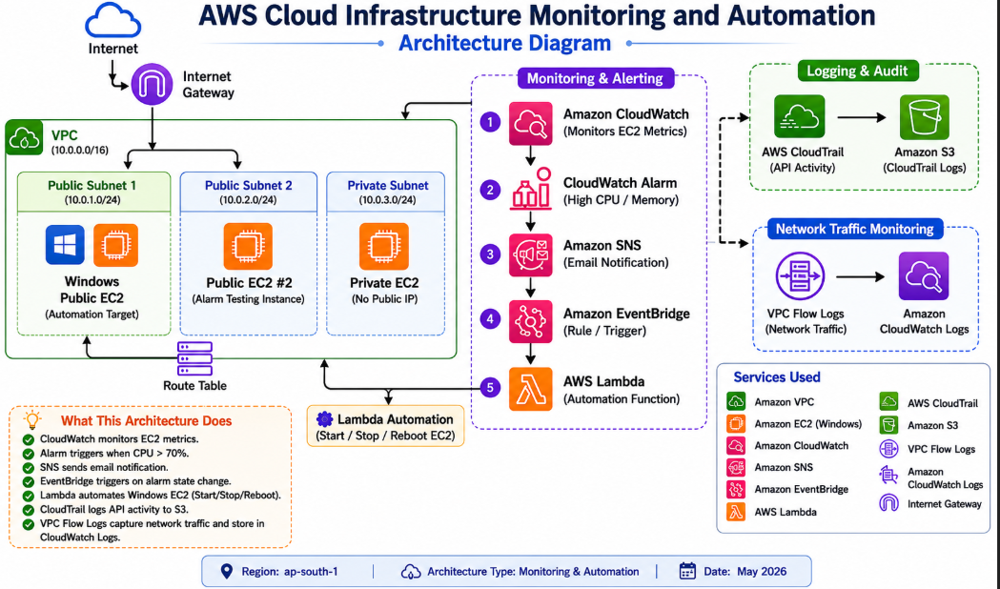

# AWS Cloud Infrastructure Monitoring and Automation

## Project Overview

This project demonstrates an AWS-based monitoring and automation solution using Amazon CloudWatch, Amazon SNS, AWS Lambda, Amazon EventBridge, AWS CloudTrail, Amazon S3, and VPC Flow Logs.

The solution continuously monitors EC2 instances, generates alerts when CPU utilization exceeds a defined threshold, sends email notifications, and performs automated operational actions through AWS Lambda.

---

## Architecture Diagram



---

## AWS Services Used

* Amazon VPC
* Amazon EC2 Instances (Windows & Linux)
* Amazon CloudWatch
* Amazon SNS
* AWS Lambda
* Amazon EventBridge
* AWS CloudTrail
* Amazon S3
* VPC Flow Logs
* Internet Gateway
* Route Tables
* Security Groups

---

## Project Architecture Workflow

1. Amazon CloudWatch monitors Linux EC2 metrics.
2. CloudWatch Alarm triggers when CPU utilization exceeds 70%.
3. Amazon SNS sends email notifications.
4. Amazon EventBridge receives alarm state changes.
5. AWS Lambda performs automated EC2 actions.
6. AWS CloudTrail records AWS API activities.
7. CloudTrail logs are stored in Amazon S3.
8. VPC Flow Logs capture network traffic and send logs to CloudWatch Logs.

---

## Key Features

* EC2 Monitoring using CloudWatch
* CPU Utilization Alerting
* SNS Email Notifications
* Event-Driven Automation
* Lambda-Based EC2 Management
* CloudTrail Auditing
* VPC Network Traffic Monitoring
* CloudWatch Metrics and Logs Monitoring

---

## Project Structure

```text
aws-cloud-infrastructure-monitoring-and-automation/

├── Architecture-Diagram/
├── Screenshots/
├── Lambda-Code/
├── Documentation/
└── README.md
```

---

## EC2 Deployment

* Windows Public EC2 (Automation Target)
* Linux EC2 Instance (CloudWatch Monitoring & Alarm Testing)
* Private EC2 Instance (No Public IP)

---

## Implementation Summary

### VPC Setup

* Created custom VPC (10.0.0.0/16)
* Configured public and private subnets
* Attached Internet Gateway
* Configured route tables

### Security Configuration

* Configured Security Groups
* Implemented public and private network segmentation

### Monitoring and Alerting

* CloudWatch metrics monitoring
* CPU utilization alarms
* SNS email notifications

### Automation

* EventBridge integration
* Lambda automation for EC2 operations

### Logging and Auditing

* CloudTrail enabled
* Logs delivered to Amazon S3
* VPC Flow Logs configured
* CloudWatch Logs integration

---

## Testing and Validation

The following validations were successfully completed:

* CloudWatch Alarm Testing
* SNS Email Notification Testing
* Lambda Execution Testing
* EventBridge Trigger Validation
* CloudTrail Logging Verification
* VPC Flow Logs Verification
* EC2 Monitoring Validation

All proof screenshots are available in the **Screenshots** folder.

---

## Learning Outcomes

Through this project, the following AWS concepts were implemented and validated:

* Amazon VPC Networking
* Public and Private Subnets
* Internet Gateway and Route Tables
* Security Groups
* EC2 Deployment and Administration
* CloudWatch Monitoring and Alarms
* SNS Notifications
* Lambda Automation
* EventBridge Event Routing
* CloudTrail Auditing
* Amazon S3 Storage
* VPC Flow Logs Monitoring

---

## Conclusion

This project demonstrates a practical AWS cloud monitoring and automation solution that combines monitoring, alerting, logging, auditing, and automated operational response using native AWS services. The implementation provides hands-on experience with real-world cloud infrastructure monitoring and event-driven automation.
